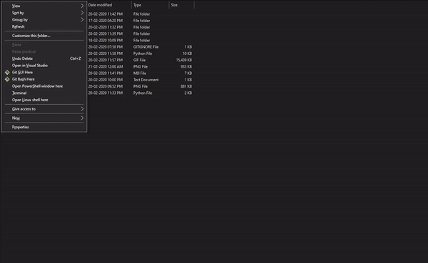
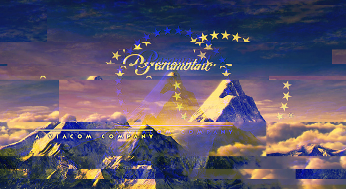
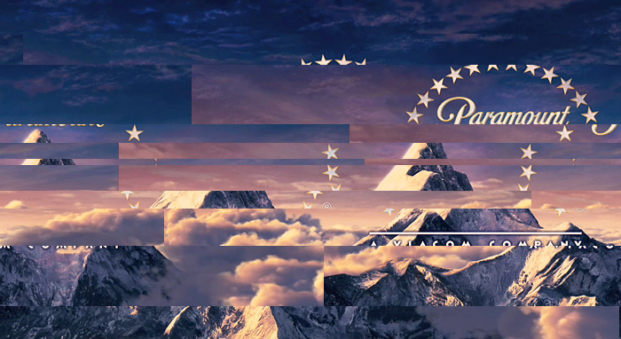
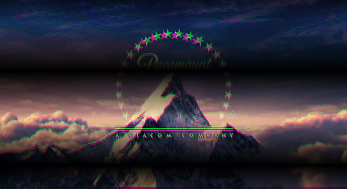
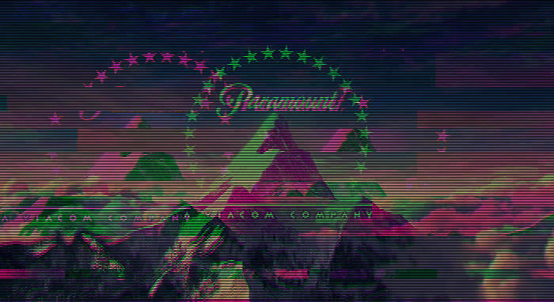
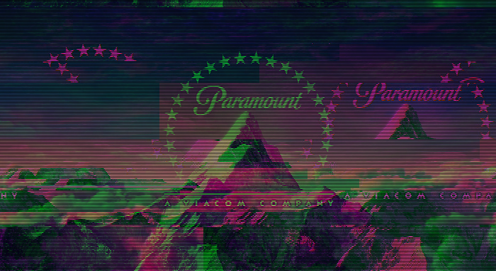

## Glitch This!
A commandline tool + `python` library to glitchify images and **even make GIFs** out of them!
Featuring *10 different levels of glitching intensity*! The algorithm used to create glitched images is a slightly modifed version of the popular [ImageGlitcher](https://www.airtightinteractive.com/demos/js/imageglitcher/) tool's algorithm, so you can expect the glitched images to look really cool!

If you like using this tool, please consider **starring on Github**!


**NOTE** : Works best with RGB/RGBA images

## Changelog
View the changelog [here](https://github.com/TotallyNotChase/glitch-this/blob/master/CHANGELOG.md)

## FEATURES!
* Choose from *10 gradually different levels* of **glitching intensity**!
  Want just a tiny bit of glitching, enough to make your image look cool? - use level 2 (my favorite)!
* Create **Glitched GIFs** from a normal image!
  That's right, before this tool, I had to manually download each image from [ImageGlitcher](https://www.airtightinteractive.com/demos/js/imageglitcher/), save them, and then head to a GIF creation website.
  Now you can do it *all* at once!
* Customize the **number of frames** in a GIF as well as their **duration** - all from the comfort of your terminal!
* Add **scan lines** for a retro CRT effect!
* Oh and did I mention, **color offset**? Just like [ImageGlitcher](https://www.airtightinteractive.com/demos/js/imageglitcher/), this tool *glitches the color channels* as well as the pixels - for **very convincing** looking glitched images!

## Requirements
* `python 3`
* `pillow`
* `numpy`

You can install the required packages all at once through the included `requirements.txt`
## Installation - The script
* Download or clone this repo to a local folder
  ```
  cd /path/to/clone-folder
  git clone https://github.com/TotallyNotChase/glitch-this.git
  ```
* While inside the folder, install the `requirements.txt`

  ```
  pip install -r requirements.txt
  ```

  (OR)

  ```
  pip3 install -r requirements.txt
  ```

*OR*, if you're a wizard and don't need no help, download just the `glitch_this.py` standalone script and invoke it!

That's it! You can now use the script and/or the library!

## Installation - The library
If you'd like to use the `glitch_this` module as a library, all you have to do is install it from [pypi](https://pypi.org/project/glitch-this/)!

Just make sure `wheel` is installed first and run

```
pip install glitch-this
```

(OR)

```
pip3 install glitch-this
```

## Usage - `glitch_this.py`
The script is designed to be used from the terminal, you can invoke it using `python ./glitch_this.py` and pass in the required/optional parameters.

### TL;DR - Basic Usage

Simply pass in the **image path** and **glitch level**!


### TL; DR - GIF creation

Same as last time, just include the `-g` option



Here's some points about the parameters - and what they do!

* `-h` : Shows help text, use this to get used to the parameters!

  Ex - `python ./glitch_this.py -h`

  (OR) `python3 ./glitch_this.py -h`
#### Required Parameters
  * `IMAGE_PATH` : The script needs to know, what file you want to glitchify right?

    That's *exactly* what this is for, you supply the full/relative path to the image you want to glitchify.

    Remember, the path **must** *exist as an image file*. `PNG`, `JPEG` are certainly preferred.

    Ex - `python ./glitch_this.py test.png`

    (OR) `python3 ./glitch_this.py test.png`

  * `GLITCH_LEVEL` : An integer between 1 to 10 (including both 1 and 10), signifying *how glitched* the output image should be.

    1 stands for "you call this glitched?", 10 stands for "good luck understanding this one"

    *my personal favorite is 2 if anyone cares :P*

    Ex - `python ./glitch_this.py 2`

    (OR) `python3 ./glitch_this.py 2`

So, with all the required parameters in place, this is how the command should look like - `python ./glitch_this.py test.png 2`
#### Optional Parameters

  * `-c` : If included, the glitched image will have a color offset, **more realistic** glitching!

    Ex - `python ./glitch_this.py -c test.png 2`

    (OR) `python3 ./glitch_this.py -c test.png 2`

  * `-s` : If included, the glitched image will have scan lines

    Ex - `python ./glitch_this.py -s test.png 2`

    (OR) `python3 ./glitch_this.py -s test.png 2`
  * `-g` : If included, the output will be GIF

    Ex - `python ./glitch_this.py -g test.png 2`

    (OR) `python3 ./glitch_this.py -g test.png 2`

  * `-f FRAMES` : Specify the number of glitched images to be used in GIF

    Defaults to 23

    Ex - `python ./glitch_this.py -g -f 10 test.png 2`

    (OR) `python3 ./glitch_this.py -g -f 10 test.png 2`

  * `-d DURATION` : Specify the time (in centiseconds - hundredths of a second), a single frame is visible

    Defaults to 200

    Ex - `python ./glitch_this.py -g -d 500 test.png 2`

    (OR) `python3 ./glitch_this.py -g -d 500 test.png 2`

    *tip : if you want the GIF to be slower, supply a bigger duration value*

## Usage - `glitch_this` library
A full example of how you can use the class is in `test_script.py`

The function `glitch_image` in `ImageGlitcher` takes 3 parameters:-
  * `src_img_path` : Full/Relative path to image

  * `glitch_amount`: Intensity/Level of glitching, must be between 1 to 10 (including both 1 and 10)

  * `color_offset` : Set to `True` if you want **color offset** to be added to output image, *more realistic* glitching!

     Defaults to `False`

  * `scan_lines` : Set to `True` if you want **scan lines** effect to be added to output image

     Defaults to `False`

## Peformance
The algorithm is pretty fast, however larger image files will take longer to glitch
It is recommended to keep the `FRAMES` parameter as low as possible, especially for large images. Simply for memory and performance concerns

## Whoa! Cool Glitches
Here's some glitched images generated from this script - of different intensity levels!

**NOTE**: All these images had `-c` parameter included, for color offset

#### Original image for reference:-


#### Glitched version - Level 2:-


*Not badly glitched now is it?*

#### Glitched version - Level 5:-



*Well it's certainly starting to get glitchy*

#### Glitched version - Level 8:-



*I don't know what I'm looking at*

Let's get some **scan lines** on there!

#### Glitched version (scan_lines)- Level 2:-



#### Glitched version (scan_lines) - Level 5:-



#### Glitched version (scan_lines) - Level 8:-



That's neat, but how about some GIFs? Here's some GIFs from the same image:-

*Note: All the GIFs use default values from `FRAMES` and `DURATION`, i.e 23 and 200 respectively*

#### Glitched GIF - Level 2:-


#### Glitched GIF - Level 5:-


#### Glitched GIF - Level 8:-


